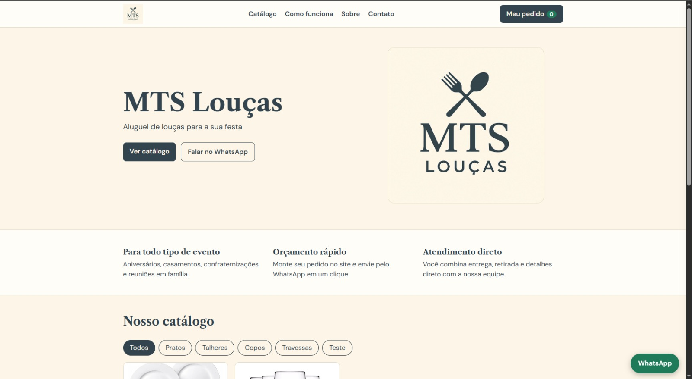
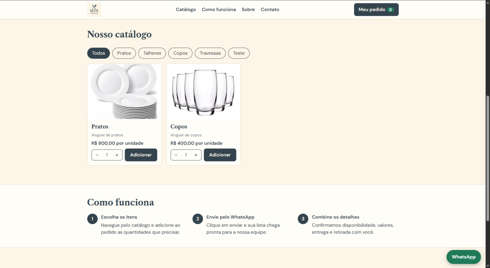
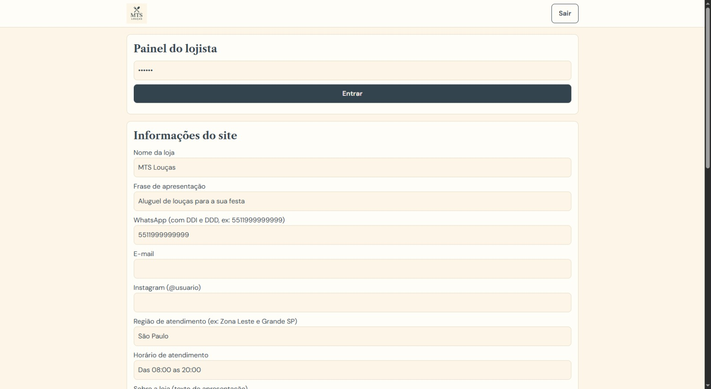

# MTS Aluguel de Louças

Site para uma loja de aluguel de louças para festas e eventos. O cliente monta o pedido no catálogo e envia a lista pronta para o WhatsApp da loja. O lojista gerencia itens, fotos e contatos por um painel administrativo, sem mexer em código.

> O site ainda não está hospedado. Veja abaixo como rodar localmente.

## Prints





## Funcionalidades

**Para o cliente**
- Catálogo de louças com filtro por categoria e galeria com mais de uma foto por item
- Carrinho "Meu pedido" com controle de quantidade, total estimado e data do evento
- Envio do pedido para o WhatsApp da loja com a mensagem já montada
- Carrinho salvo no navegador (`localStorage`), que não se perde ao recarregar a página
- Seções de apresentação da loja, "Como funciona", sobre e rodapé com contatos (e-mail, Instagram, endereço, horário)
- Layout responsivo para celular, tablet e computador

**Para o lojista (painel em `/admin.html`)**
- Login por senha
- Cadastro, edição e remoção de itens (nome, categoria, preço, descrição, disponibilidade)
- Upload de até 8 fotos por item (JPG, PNG ou WebP, até 5 MB cada)
- Edição de número do WhatsApp, nome e slogan da loja, texto "sobre", e-mail, Instagram, endereço e horário

## Tecnologias

- **Front end:** HTML, CSS e JavaScript puro
- **Back end:** Node.js, Express e Multer (upload de imagens)
- **Armazenamento:** arquivo JSON (`data/db.json`) e fotos em disco (`public/uploads`)

## Como rodar

Pré-requisito: [Node.js](https://nodejs.org) instalado.

```bash
git clone https://github.com/SEU-USUARIO/mts-loucas.git
cd mts-loucas
npm install
```

Defina a senha do painel e inicie o servidor:

```bash
# Windows (PowerShell)
$env:ADMIN_PASSWORD="suasenha"; npm start

# Mac/Linux
ADMIN_PASSWORD=suasenha npm start
```

- Site: http://localhost:3000
- Painel do lojista: http://localhost:3000/admin.html

Se `ADMIN_PASSWORD` não for definida, a senha padrão é `mts123`. **Troque antes de colocar no ar.**

## API

| Método | Rota | Descrição | Autenticação |
|--------|------|-----------|--------------|
| GET | `/api/site` | Configurações e itens do catálogo | Não |
| POST | `/api/login` | Login do lojista (retorna token de sessão) | Não |
| PUT | `/api/settings` | Atualiza as configurações da loja | Sim |
| POST | `/api/items` | Cria item com fotos | Sim |
| PUT | `/api/items/:id` | Edita item e fotos | Sim |
| DELETE | `/api/items/:id` | Remove item e suas fotos | Sim |

## Estrutura

```
mts-loucas/
├── server.js          # servidor Express e API
├── package.json
├── public/
│   ├── index.html     # site do cliente
│   ├── admin.html     # painel do lojista
│   ├── app.js         # catálogo, carrinho e envio ao WhatsApp
│   ├── style.css
│   └── logo.jpg
├── data/              # criado automaticamente (db.json)
└── public/uploads/    # criado automaticamente (fotos)
```

## Processo de desenvolvimento

Projeto desenvolvido com apoio de IA (Claude), com minha revisão, testes e ajustes. Eu defini os requisitos a partir da necessidade da loja: vendas pelo WhatsApp, painel simples para o dono e layout claro para o cliente.

## Próximos passos

- Hospedar o site (deploy)
- Guardar a senha do painel com hash e usar sessões persistentes
- Migrar o armazenamento de JSON para um banco de dados SQL

## Autor

**Guilherme** — estudante de Análise e Desenvolvimento de Sistemas (Unicid), em busca da primeira oportunidade em tecnologia.
[LinkedIn](COLE-SEU-LINK) · [e-mail](mailto:SEU-EMAIL)
